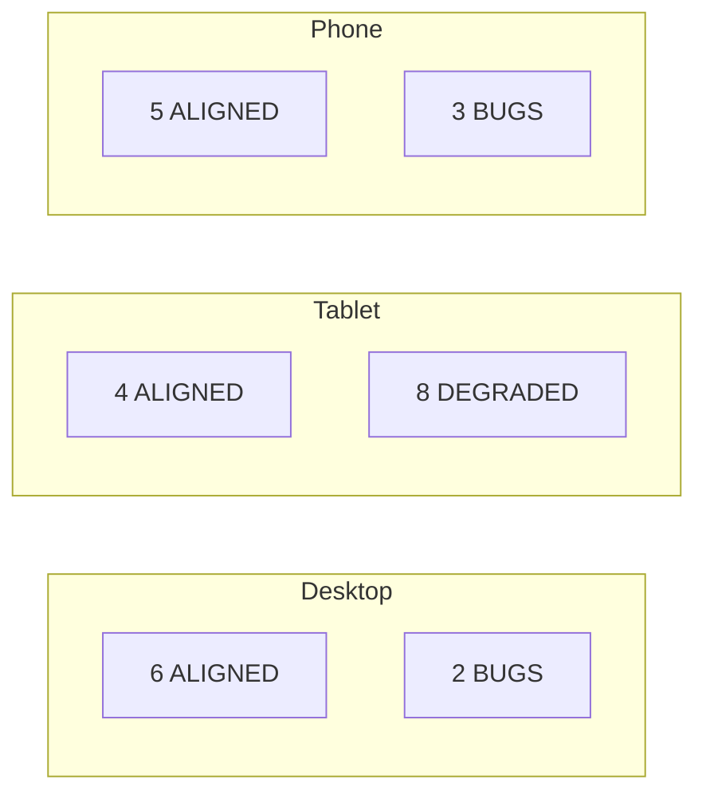

# ATDD Methodology

Acceptance Test-Driven Development with CEO specifications as the single source of product truth.

## The Problem We Solved

Traditional testing verifies that code does what the developer intended. ATDD verifies that code does what the **CEO intended**. The CEO writes product specifications (algorithm formulas, display rules, data requirements). We verify those specifications against the actual code.

## The Pipeline

```
UNDERSTAND → SPECIFY → REVIEW → MAP → IMPLEMENT → AUDIT → VERIFY → ASSESS
```

1. **UNDERSTAND**: CEO writes product specification (algorithm, display rules, acceptance criteria)
2. **SPECIFY**: AI agents produce WE_EXPECT documents (structural invariants derived from spec)
3. **REVIEW**: 12-session review process (7 functional + 5 system components) with RTM tracking
4. **MAP**: Requirements Traceability Matrix (RTM) maps every CEO expectation to code location
5. **IMPLEMENT**: GAMMA agents write tests that check CEO expectations against real data
6. **AUDIT**: BETA agent audits test quality (do tests check VALUES, not just render?)
7. **VERIFY**: ALPHA evaluates on production (E2E, Playwright, k6, chaos)
8. **ASSESS**: SIGMA agent assesses component readiness across 7 dimensions

## CEO Specification Library

42 CEO documents mapping to 35 MVPs across 50+ components:

- **CEO Algorithms**: Congestion formula, fee estimation, timer calculations, mempool heuristics
- **CEO Specs**: API design, dashboard behavior, CRM workflows, billing rules
- **Acceptance Criteria**: BDD-style per-widget specifications (11-section template)

Coverage: 14 STRONG, 8 MODERATE, 10 NO_SPEC, 3 COVERED_BY_PARENT

## Requirements Traceability Matrix (RTM)

Each reviewed component produces an RTM with gap analysis:

| Category | Meaning |
|----------|---------|
| **ALIGNED** | CEO expectation matches code behavior |
| **MISSING** | CEO expects something the code doesn't do |
| **UNDOCUMENTED** | Code does something the CEO didn't specify |
| **BUG** | Code contradicts the CEO specification |

Results from 12 review sessions: **56 ALIGNED, 14 MISSING, 18 UNDOCUMENTED, 24 BUGS**

## The Bug Heatmap

Bugs clustered heavily on tablet viewport (8/12 sessions showed tablet degraded or broken):



This data drove the tablet detail panel fix (WQ-714) and responsive layout improvements.

## WE_EXPECT Documents

25 deep-dive component analyses (300-450 lines each), covering:

- Structural invariants (what MUST be true regardless of state)
- Data flow tracing (source → transformer → cache → WebSocket → render)
- Viewport-specific behavior (desktop/tablet/phone differences)
- Edge cases and error states
- Playwright test gaps

These documents are the bridge between CEO intent and test assertions.

## CEO Question Sessions

When gaps are found, questions are batched and prioritized for CEO review:

- **P0**: Blocking production (e.g., tablet panel missing, algorithm disagreement)
- **P1**: Affects user experience (e.g., confirmation count: spec says 1, code says 3)
- **P2**: Enhancement opportunities

28 questions were produced, 7 answered directly by CEO, remainder resolved by engineering.
