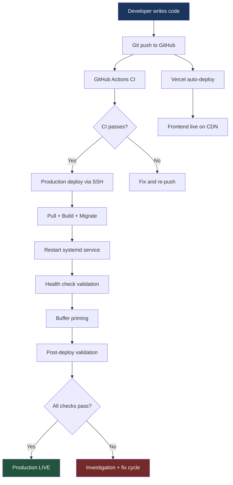
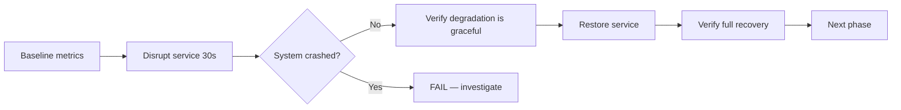

# CI/CD Pipeline

BlockSight uses a multi-stage deployment pipeline with production chaos testing. We deploy to a dedicated server running a full Bitcoin node, then intentionally break infrastructure to verify resilience.

## Deployment Flow



## Four Applications

| App | URL | Deploy Method |
|-----|-----|---------------|
| Explorer | blocksight.live | Vercel (auto on push) |
| Admin | admin.blocksight.live | Vercel (auto on push) |
| Portal | portal.blocksight.live | Vercel (auto on push) |
| API | api.blocksight.live | Hetzner (manual deploy) |

Frontend apps deploy automatically via Vercel CDN. Backend deploys to a dedicated Hetzner server via SSH.

## Backend Deploy Sequence

```
 1. Pull latest from GitHub
 2. Install dependencies (npm ci --production)
 3. Build TypeScript (tsc + tsc-alias)
 4. Database migrations run automatically on startup
 5. Restart backend service (systemd)
 6. Health check: /healthz returns 200
 7. Readiness check: /readyz returns 200 (cache warm)
 8. Buffer priming: pg_prewarm for hot query paths
 9. Run post-deploy validation suite
10. Grade the deployment cycle (A through F)
```

The deployment script is idempotent. Running it twice produces the same result.

## GitHub Actions CI

Every push triggers automated checks:

- TypeScript type checking (`tsc --noEmit`)
- Biome linting (formatting + code quality rules)
- Unit test suite (Jest)
- Architecture rule verification (dependency-cruiser, 6 DDD boundary rules)

CI must pass before production deploy.

## Post-Deploy Validation (5 Checks)

After every production deploy, a structured evaluation runs:

| Check | What | Target |
|-------|------|--------|
| Health | `/healthz` + `/readyz` return 200 | Immediate |
| API smoke | Key endpoints return expected shapes | All pass |
| E2E | Data accuracy tests against live blockchain | 97%+ |
| k6 | Smoke test: 24 endpoint checks | 24/24 |
| Chaos | 10-phase infrastructure resilience | 10/10 |

Additional optional checks: soak test (60 min), Playwright visual regression (29 specs), coverage measurement.

## Infrastructure Stack

| Component | Role | Version |
|-----------|------|---------|
| Node.js | Backend runtime | v22 LTS |
| PostgreSQL | Persistence + migrations | 16.x |
| Redis | L2 cache + pub/sub | 7.x |
| Bitcoin Core | Full node, blockchain source of truth | v29.0 |
| Fulcrum | Electrum protocol server (replaced electrs) | 2.1.0 |
| Prometheus | Metrics collection (81 metrics) | Latest |
| Grafana | Dashboards + Telegram alerting | 12.4.2 |
| Cloudflare | DNS + CDN + tunnel | Managed |

## Observability

- **81 Prometheus metrics** covering HTTP latency, WebSocket connections, cache hit rates, RPC performance, blockchain state, and circuit breaker status
- **Grafana dashboards** with real-time visualization and Telegram alerting for critical thresholds
- **Structured logging** with Winston (JSON format, correlation IDs across request lifecycle)
- **Circuit breakers** on all 6 external dependencies with automatic recovery tracking

## Chaos in Production

We chaos test on the **live production system**, not a staging environment:



**Why production, not staging?** Because staging doesn't have 950,000 real Bitcoin blocks, 8,000 live mempool transactions, or 75 connected peers. Testing degradation on synthetic data proves nothing about how the system behaves with real load.

10 phases. 10 services. Every failure mode verified on the real system. Current record: **10/10 pass** (first full-mode run, PL-C26).

## Production Evaluation Cycles

Each deployment triggers a graded evaluation cycle (PL-C{N}):

| Cycle | Grade | E2E | k6 | Chaos | Soak |
|-------|-------|-----|-----|-------|------|
| PL-C24 | B+ | 81.2% | 24/24 | 4/4 | N/A |
| PL-C25 | A- | 95.1% | 24/24 | 4/4 | 0.00% |
| PL-C26 | **A** | **97.4%** | **24/24** | **10/10** | 0.04% |

27 cycles completed. Metrics improve monotonically because each cycle's failures become the next cycle's fix targets.
