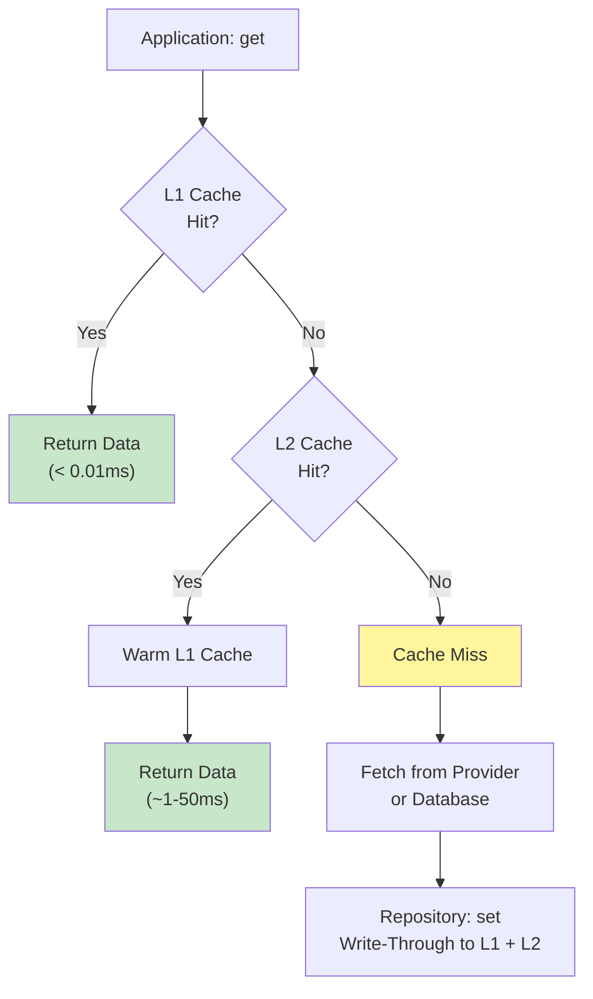
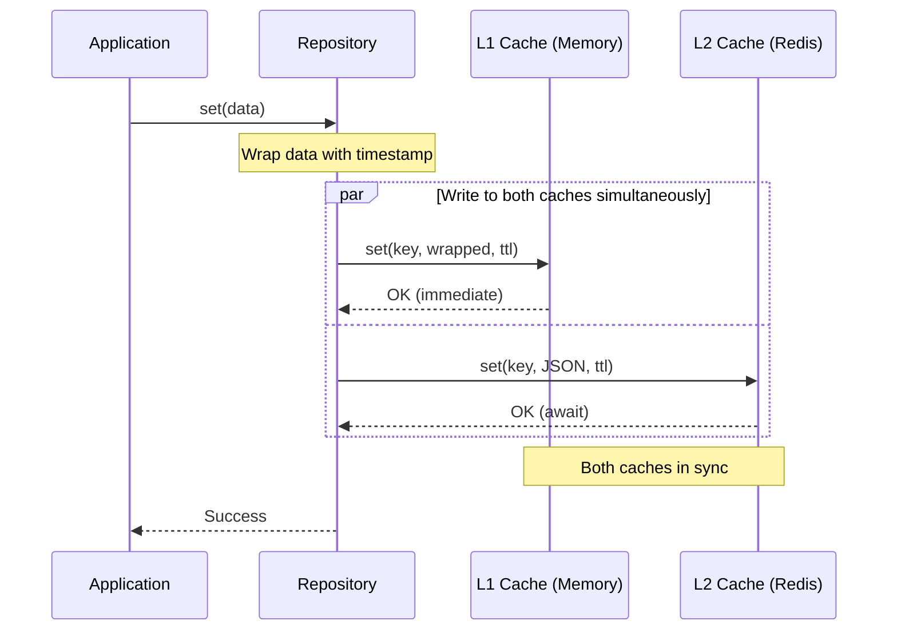
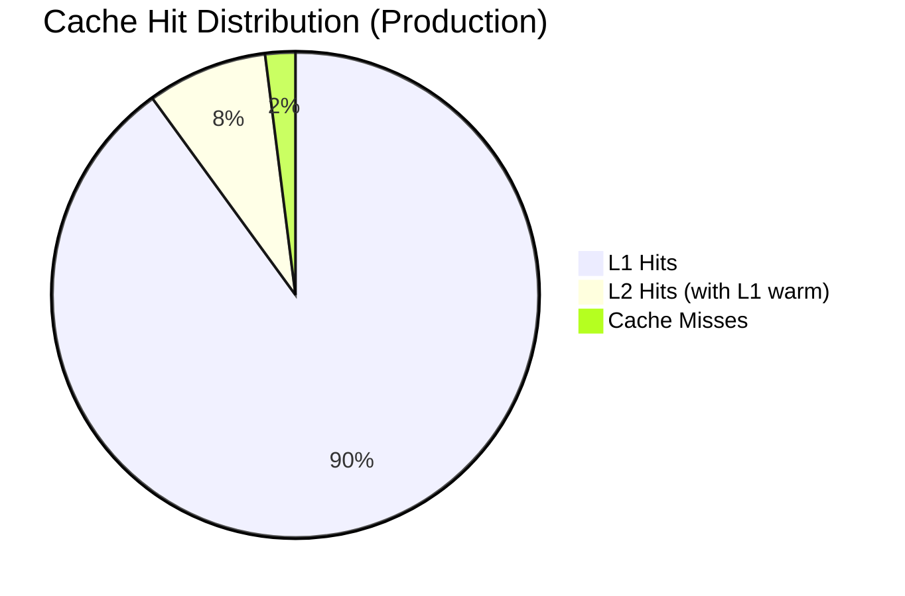
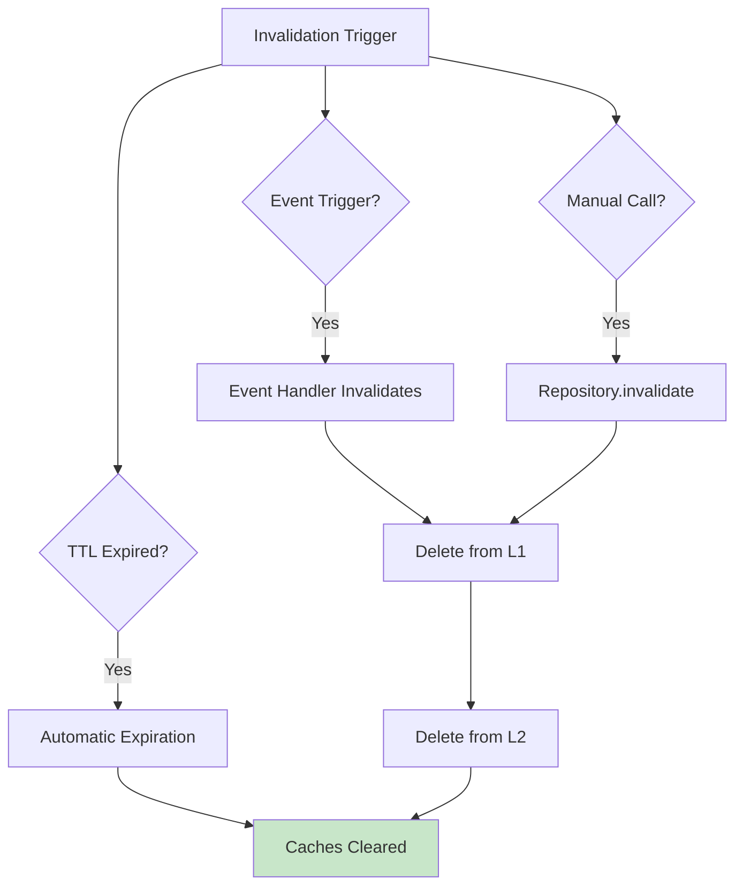

# Cache Architecture

BlockSight uses a three-layer caching strategy: L1 in-memory LRU, L2 Redis, and PostgreSQL as the persistence layer. This design delivers sub-millisecond cache hits for real-time data while maintaining durability for historical blockchain data.

---

## Three-Layer Overview

```mermaid
graph TB
    subgraph Application["Application Layer"]
        APP[Application Service]
    end

    subgraph Repository["Repository Layer (Cache-Aside)"]
        REPO[Repository<br/>get / set / invalidate]
    end

    subgraph Cache["Two-Tier Cache System"]
        subgraph L1["L1 — In-Memory LRU"]
            L1NODE[MemoryCacheAdapter]
            L1DATA[(Process Memory)]
            L1NODE --> L1DATA
        end

        subgraph L2["L2 — Redis"]
            L2REDIS[Redis]
            L2DATA[(Persistent Storage)]
            L2REDIS --> L2DATA
        end
    end

    subgraph Persistence["Persistence Layer"]
        PG[(PostgreSQL)]
    end

    APP -->|get| REPO
    REPO -->|1. Check L1| L1NODE
    L1NODE -.2a. Hit.-> REPO
    L1NODE -.2b. Miss.-> L2REDIS
    L2REDIS -.3a. Hit + Warm L1.-> REPO
    L2REDIS -.3b. Miss.-> REPO
    REPO -.4. Miss.-> PG

    APP -->|set| REPO
    REPO -->|Write-Through| L1NODE
    REPO -->|Write-Through| L2REDIS

    style L1NODE fill:#fff59d
    style L2REDIS fill:#ffccbc
```

---

## Read Flow



---

## Write Flow (Write-Through)



---

## Cache Hit Scenarios

### Best Case — L1 Hit
```
App → L1 (HIT) → Return
Latency: < 0.01ms
```

### Medium — L1 Miss, L2 Hit
```
App → L1 (MISS) → L2 (HIT) → Warm L1 → Return
Latency: ~10-50ms
```

### Worst Case — Both Miss
```
App → L1 (MISS) → L2 (MISS) → Fetch from provider → Write to L1 + L2 → Return
Latency: ~500-2000ms (depends on data source)
```

---

## Cache Hit Distribution



**Targets**: L1 hit rate >90%. L2 hit rate (of L1 misses) >80%. Combined >95%.

---

## TTL Strategy

Different data types use different TTLs based on how frequently they change:

| Data Type | TTL | Reasoning |
|-----------|-----|-----------|
| Confirmed blocks | 3600s | Immutable once confirmed |
| Confirmed transactions | 3600s | Immutable once confirmed |
| Unconfirmed transactions | 300s | May confirm or expire |
| Address balances | 300s | Change with each transaction |
| Blockchain info | 30s | Updates every block (~10 min avg) |
| Mempool data | 35s | Polled every 30s |
| Block headers (batch) | 86400s (24h) | Historical, rarely changes |

---

## Invalidation

Three invalidation mechanisms:

1. **TTL-based** — automatic expiration in both L1 and L2
2. **Event-based** — EventBus events (e.g., `block.mined`, `blocks.enriched`) trigger targeted invalidation
3. **Manual** — application calls `repository.invalidate(key)` which deletes from both caches



---

## L1 vs L2 Configuration

| Property | L1 (In-Memory) | L2 (Redis) |
|----------|----------------|------------|
| Max entries | 5,000 keys | Memory-limited |
| Eviction | LRU | allkeys-lru |
| Persistence | None (process memory) | RDB + AOF |
| Cleanup | Every 60s | Automatic |
| Latency | < 0.01ms | ~1-50ms |
| Shared across processes | No | Yes |

---

## Important Architectural Notes

- **RPC Coordinator has its own L1**: An independent `Map<>` cache for block lookups, separate from the BaseRepository L1 cache. This avoids contention between real-time polling and explorer queries.
- **Circuit breaker protection**: Redis operations are wrapped in a circuit breaker. If Redis is down, the system falls back to L1-only caching with graceful degradation.
- **Write-through, not write-back**: Both caches are updated synchronously on writes. This ensures consistency at the cost of slightly higher write latency.

---

**See also**: [[Data Flow]] | [[WebSocket Architecture]] | [[Component Bible]]
