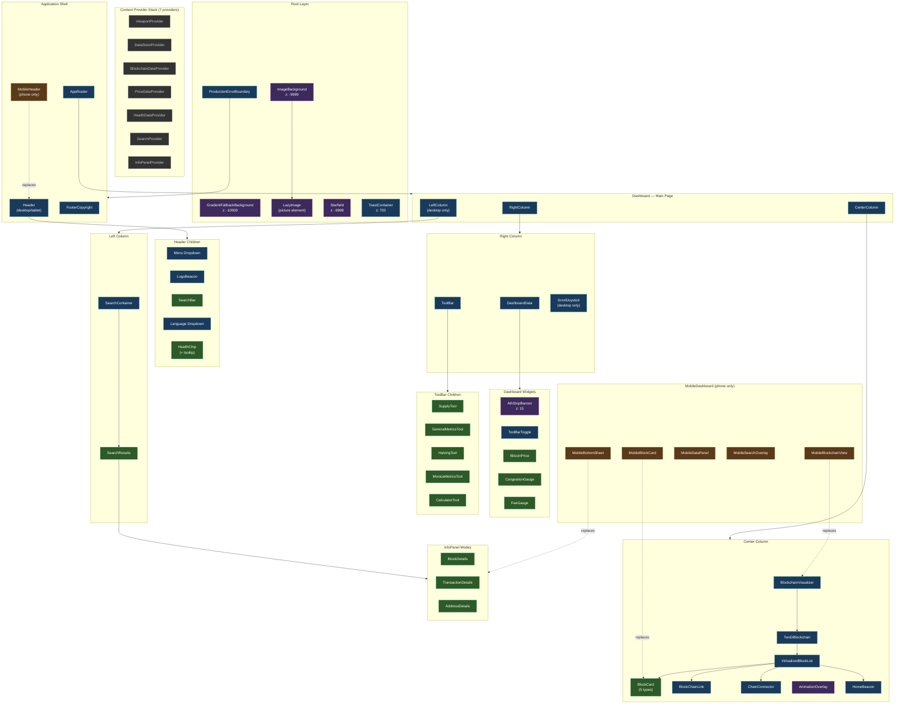

# Component Tree

The full application hierarchy showing how BlockSight's ~90 components are organized from root to leaf.

---

## Full Application Hierarchy

---

## Legend

| Color | Type | Description |
|-------|------|-------------|
| Green | Functional | Displays data, has CEO specs and algorithms |
| Blue | System | Container, layout, navigation |
| Purple | Visual | Background, animation, decoration |
| Orange | Mobile | Phone-only replacement component |
| Gray | Context | React context provider |

---

## Architecture Layers

### 1. Root Layer
Three z-indexed backgrounds (gradient, cosmic image, animated starfield) create the visual atmosphere. A production error boundary wraps the entire application for graceful failure handling.

### 2. Context Provider Stack
Seven React context providers establish the data infrastructure. Each manages a specific domain: viewport dimensions, centralized data store, blockchain data, price data, health monitoring, search state, and info panel state. Components consume data through domain-specific hooks rather than prop drilling.

### 3. Application Shell
The shell renders the appropriate header (desktop `Header` or phone `MobileHeader`), the router, and a fixed footer. The router currently serves a single dashboard route.

### 4. Dashboard (3 columns)
- **Left**: Search container + detail panels (block, transaction, address). Hidden on tablet, replaced by bottom sheet on phone.
- **Center**: The blockchain visualizer — a virtualized scrollable list of block cards (mempool, next block, confirmed blocks), connected by chain links and animated connectors. Includes the HomeBeacon navigation overlay.
- **Right**: Three real-time gauges (price, congestion, fees), an expandable toolbar with 5 analysis tools, and a scroll joystick (desktop only).

### 5. Mobile Alternative
Phone layout (<=768px) uses dedicated mobile components: `MobileHeader`, `MobileBlockchainView`, `MobileBlockCard`, `MobileSearchOverlay` (full-screen blur), and `MobileBottomSheet` (swipe to dismiss for details).

---

**See also**: [[Desktop Layout]] | [[Tablet Layout]] | [[Phone Layout]] | [[Component Bible]]
