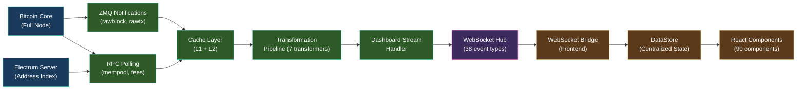
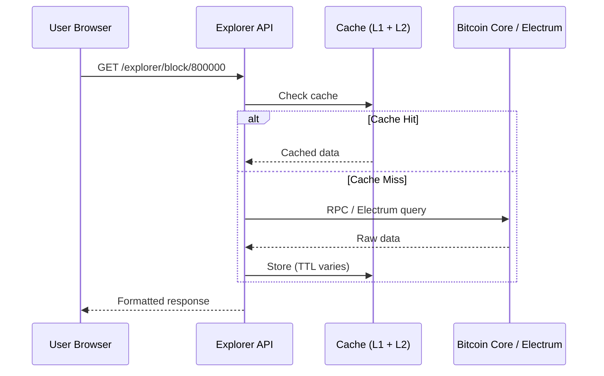

# Data Flow

End-to-end data pipeline from Bitcoin Core through transformation layers to the browser. This is how live Bitcoin data reaches your screen.

---

## High-Level Pipeline



---

## Block Entity: Source to Screen

A confirmed Bitcoin block travels through 8 steps from the moment it is mined to when it appears on a user's dashboard:

### Step 1 — ZMQ Notification
Bitcoin Core pushes a `rawblock` notification the instant a new block is received. The ZMQ handler parses the raw bytes into structured fields: height, hash, timestamp, transaction count, size, version, nonce.

### Step 2 — Persistence
The raw block metadata is written to PostgreSQL immediately. At this point, advanced statistics (fee rates, median fee, total output) are NULL — the block is in an **unenriched** state.

### Step 3 — Enrichment (async, ~60s later)
A background service calls Bitcoin Core's `getblockstats` RPC to compute detailed statistics: average fee rate, fee percentiles (p10/p25/p50/p75/p90), median fee, total fees, and more. The block transitions to an **enriched** state.

### Step 4 — Recent Blocks Cache
An in-memory cache of the last ~940 blocks is maintained. New blocks are inserted on arrival; enriched blocks trigger a refresh. This cache serves the dashboard without hitting the database on every request.

### Step 5 — WebSocket Broadcast
The DashboardStreamHandler reads from domain services and broadcasts events:

| Event | Source | Interval |
|-------|--------|----------|
| `dashboard.update` | Price + blockchain summary | 5s |
| `congestion_update` | Congestion gauge service | 30s + on new block |
| `fee_update` | Fee gauge service | 30s + on new block |
| `mempool_blocks` | Mempool projection service | Event-driven |
| `blocks_history` | Recent blocks service | On new/enriched block |
| `new_block` | ZMQ handler | Immediate |

### Step 6 — Frontend WebSocket Bridge
The frontend maintains a persistent WebSocket connection. Typed handlers deserialize each event and dispatch it to the centralized DataStore.

### Step 7 — React Context
Data flows from the DataStore into domain-specific React contexts (BlockchainDataContext, PriceDataContext, etc.), which provide hooks for components.

### Step 8 — Component Render
Components like BlockCard, BitcoinPrice, and FeeGauge consume the hooks and render live data. The virtualized block list efficiently renders hundreds of blocks with scroll virtualization.

---

## Transformation Pipeline

Seven transformers run on staggered intervals, each following a strict 4-layer DDD pattern:

```
Infrastructure:  Adapter.extract()     ← cache reads, service calls
     |
Domain:          Calculator.calculate() ← pure computation
     |
Application:     Transformer.transform() ← orchestrate + metrics
     |
Broadcast:       WebSocket Hub broadcast
```

### Transformer Schedule

| Transformer | Interval | Stagger Offset |
|-------------|----------|----------------|
| Congestion | 30s | 0s |
| Fee | 30s | 5s |
| Price | 60s | 10s |
| Statistics | 60s | 15s |
| Time Series | 300s | 20s |
| Milestone | 60s | 25s |
| Visualization | 30s | 30s |

Staggered starts prevent simultaneous RPC bursts. Each transformer yields to the event loop between executions to maintain responsiveness.

---

## Mempool Block Projection

Mempool blocks (the projected "next blocks" that haven't been mined yet) follow a separate path:

1. **Raw mempool poll** — BlockchainStateService polls `getrawmempool` every 30s
2. **Projection algorithm** — Uses the CEO-defined ancestor scoring formula: `min(AF_tx, f_tx)` to sort transactions into projected blocks
3. **Incremental updates** — Detects deltas between polls to avoid full recalculation
4. **Broadcast** — Event-driven via `mempool.rawUpdated` with a 5s fallback interval

---

## Explorer Queries (On-Demand)

Block, transaction, and address lookups use a different path — REST API with cache-aside:



**Cache TTLs**: Confirmed blocks: 3600s. Confirmed transactions: 3600s. Unconfirmed transactions: 300s. Addresses: 300s.

---

**See also**: [[Cache Architecture]] | [[WebSocket Architecture]] | [[Component Bible]]
