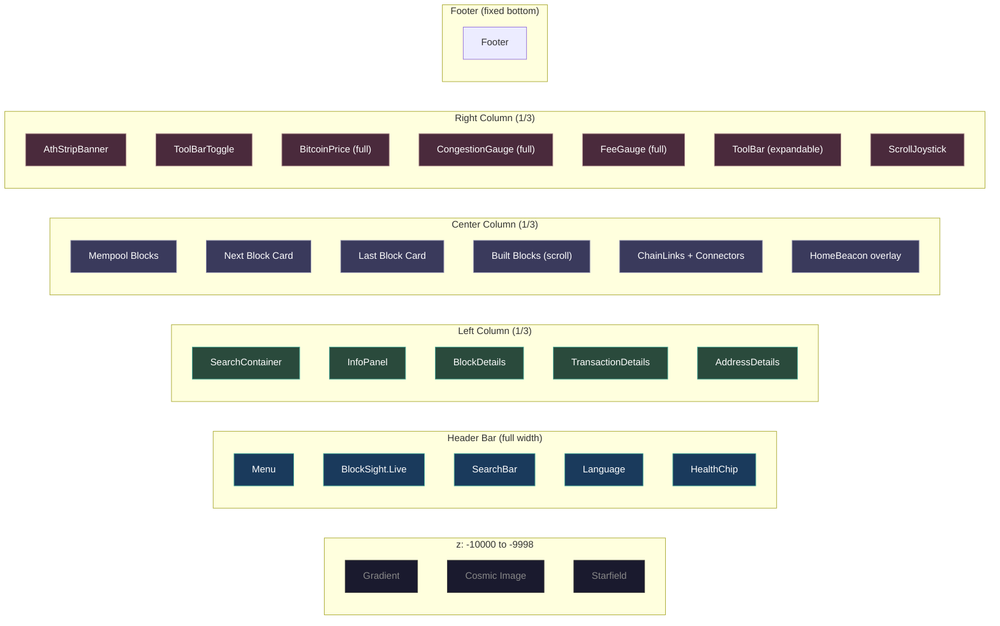

# Desktop Layout

Triple-column dashboard layout for screens wider than 1100px.

---

## Layout Diagram

---

## Desktop Characteristics

| Property | Value |
|----------|-------|
| Breakpoint | >1100px |
| Grid | `grid-template-columns: 1fr 1fr 1fr` |
| Left Column | Visible (`showLeftColumn: true`) |
| Widget Variant | `full` — all 3 gauges with tooltips on hover |
| Block Card Variant | `full` — large with fee rates, tx count, miner |
| ScrollJoystick | Visible (desktop only) |
| ToolBar | Full width, expandable, 5 tools |
| Header | Full navigation bar with search, language selector, health chip |

---

## Column Details

### Left Column — Search + Details
The left column serves two functions. At rest, it shows the search container where users can look up blocks, transactions, or addresses. When a result is selected, the InfoPanel switches to the appropriate detail view (BlockDetails, TransactionDetails, or AddressDetails) with full data display.

### Center Column — Blockchain Visualization
The centerpiece of BlockSight. A virtualized scrollable list renders block cards representing the Bitcoin blockchain in real-time:

- **Mempool section**: Projected mempool blocks (orange/amber), sized proportionally to fee density
- **Next Block**: The block being assembled, with a countdown timer
- **Last Block**: The most recently mined block, with elapsed timer
- **Built blocks**: Historical confirmed blocks, scrollable via the joystick or mouse wheel
- **Chain connectors**: Visual links between blocks with animated data flow

### Right Column — Gauges + Tools
Three real-time gauges stack vertically:
1. **BitcoinPrice** — live BTC/USD (or localized fiat) with 2-second refresh
2. **CongestionGauge** — 5-component weighted network congestion score
3. **FeeGauge** — recommended fees for next block and 6-hour target

Below the gauges, an expandable toolbar offers 5 analysis tools: supply metrics, general network stats, halving countdown, Monica metrics (custom analytics), and a BTC/fiat calculator.

---

**See also**: [[Tablet Layout]] | [[Phone Layout]] | [[Component Tree]]
