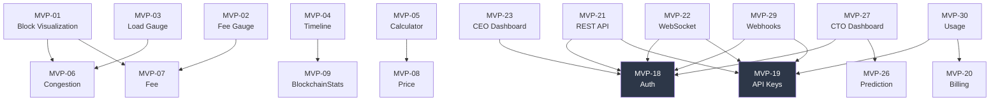

# MVP Catalog

35 MVPs across 9 categories. **All 35 implemented.** This is the complete product scope of BlockSight.

## Status Overview

| Category | MVPs | Count | Status |
|----------|------|-------|--------|
| Dashboard Widgets | MVP-01 to MVP-05 | 5 | All implemented |
| Transformation Pipeline | MVP-06 to MVP-12 | 7 | All active |
| Explorer Features | MVP-13 to MVP-17 | 5 | All implemented |
| Platform Services | MVP-18, MVP-21, MVP-22 | 3 | All implemented |
| Admin Operations | MVP-23, MVP-27, MVP-28, MVP-32 | 4 | All implemented |
| Customer Self-Service | MVP-19, MVP-20, MVP-30, MVP-33 | 4 | All implemented |
| Developer Platform | MVP-29, MVP-31 | 2 | All implemented |
| Experience & Engagement | MVP-24, MVP-25 | 2 | All implemented |
| Observability & Analytics | MVP-26, MVP-34, MVP-35 | 3 | All implemented |
| **Total** | | **35** | **35/35** |

---

## 1. Dashboard Widgets (MVP-01 to MVP-05)

The CEO's original 5 real-time widgets — the core visual experience.

| ID | Name | Description |
|----|------|-------------|
| MVP-01 | Real-Time Block Visualization | Live mempool + blockchain rendering with block shift animations, 950K+ scrollable blocks, 3-section layout (mempool / center / built) |
| MVP-02 | Fee Gauge | Real-time fee estimation with color-coded zones (green < 5, yellow 5-20, orange 20-50, red >= 50 sat/vB) |
| MVP-03 | Load Gauge (Congestion) | CEO's congestion algorithm: 5-component score (mempool vBytes, fee pressure, delay, prediction accuracy, tx velocity) |
| MVP-04 | Bitcoin Timeline | Historical block timeline with classification (empty/partial/mixed/full) |
| MVP-05 | Bitcoin Calculator | BTC to USD/fiat conversion with 25-language secondary currency support |

## 2. Transformation Pipeline (MVP-06 to MVP-12)

Seven scheduled transformers converting raw Bitcoin data into broadcast-ready payloads.

| ID | Name | Interval | Input |
|----|------|----------|-------|
| MVP-06 | Congestion Transformer | 30s | Mempool vBytes, fees, block times |
| MVP-07 | Fee Transformer | 30s | estimatesmartfee RPC (1, 6, 144 blocks) |
| MVP-08 | Price Transformer | 60s | CoinCap (primary) + CoinGecko (failover) |
| MVP-09 | BlockchainStats Transformer | 60s | Bitcoin Core RPC (difficulty, hashrate, supply) |
| MVP-10 | TimeSeries Transformer | 5 min | Historical fee + block data |
| MVP-11 | Milestone Transformer | 60s | Halving countdowns, supply milestones |
| MVP-12 | VisualizationData Transformer | 30s | Aggregated multi-source visualization |

## 3. Explorer Features (MVP-13 to MVP-17)

Block, transaction, and address search with full detail views.

| ID | Name | Description |
|----|------|-------------|
| MVP-13 | Block Search & Details | Search by height or hash, full block data (miner, fees, tx count, size) |
| MVP-14 | Transaction Search & Details | Prevout lookup for inputs, fee calculation, confirmation time estimate |
| MVP-15 | Address Search & Details | Balance, UTXO set, transaction history with pagination |
| MVP-16 | Address Tracking | Real-time address monitoring via WebSocket (tier-gated) |
| MVP-17 | Block Classification | Empty/partial/mixed/full classification with visual indicators |

## 4. Platform Services (MVP-18, MVP-21, MVP-22)

Cross-cutting platform capabilities.

| ID | Name | Description |
|----|------|-------------|
| MVP-18 | Authentication | Registration, login, session management, optional TOTP 2FA |
| MVP-21 | REST API (Tiers) | 120+ endpoints with tier-based access control (Basic/Advanced/Premium+) |
| MVP-22 | WebSocket (Tiers) | 38 event types with tier-based subscription authorization |

## 5. Admin Operations (MVP-23, MVP-27, MVP-28, MVP-32)

Internal admin tools for business intelligence and operations.

| ID | Name | Description |
|----|------|-------------|
| MVP-23 | CEO Dashboard | Revenue analytics, customer metrics, health overview, usage patterns |
| MVP-27 | CTO Dashboard | Service toggles, cache controls, feature flags, log viewer, prediction observatory |
| MVP-28 | CRM System | Client search/filter, transaction export, document management, audit trail |
| MVP-32 | Maintenance Mode | Scheduled downtime management with customer notifications |

## 6. Customer Self-Service (MVP-19, MVP-20, MVP-30, MVP-33)

Customer portal features for self-service management.

| ID | Name | Description |
|----|------|-------------|
| MVP-19 | API Key Management | HMAC-SHA256 key generation, rotation with 24h grace period, revocation |
| MVP-20 | Subscription & Billing | Bitcoin-only annual payments, invoice lifecycle, HD wallet address derivation |
| MVP-21 | Usage Analytics | Per-key request logging, rate limit visibility, threshold alerts |
| MVP-33 | Team Management | 5-role hierarchy (owner/admin/developer/billing/viewer), invitation system |

## 7. Developer Platform (MVP-29, MVP-31)

Developer-facing integration tools.

| ID | Name | Description |
|----|------|-------------|
| MVP-29 | Webhook System | 16 event types, HMAC-SHA256 signatures, exponential backoff retry (3 attempts) |
| MVP-31 | API Documentation | Interactive REST API docs with tier-specific endpoint visibility |

## 8. Experience & Engagement (MVP-24, MVP-25)

| ID | Name | Description |
|----|------|-------------|
| MVP-24 | Easter Eggs | Hal Finney tribute, Pizza Day, ATH celebration — hidden discovery features |
| MVP-25 | Settings Panel | User preferences and customization |

## 9. Observability & Analytics (MVP-26, MVP-34, MVP-35)

| ID | Name | Description |
|----|------|-------------|
| MVP-26 | Prediction Observatory | Measures mempool projection accuracy (txid %, fee %, block time) |
| MVP-34 | Monica Bitcoin Metrics | 5 derived indicators (BVP, RUR, FPI, TTS, EDI) — "what does activity mean?" |
| MVP-35 | Miner Identification | Coinbase transaction parsing, 20+ known mining pool identification |

---

## Dependency Matrix

Key inter-MVP dependencies (A depends on B):

The dependency graph shows that **Authentication (MVP-18)** and **API Key Management (MVP-19)** are the two foundational platform services — 10 other MVPs depend on them.
