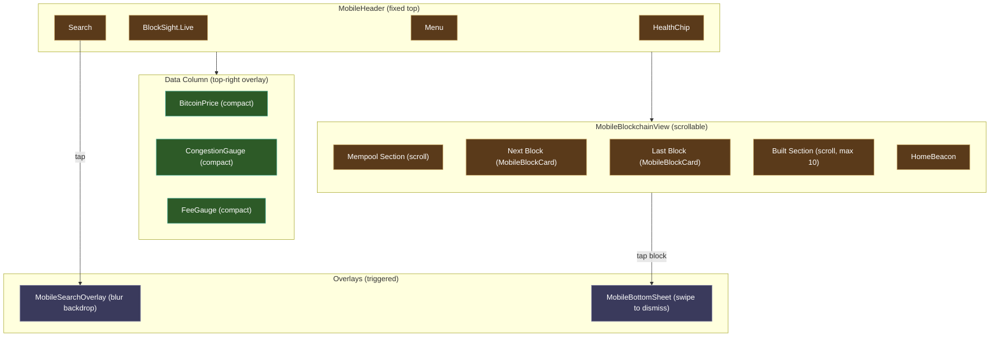

# Phone Layout

Single-column mobile layout for screens narrower than 769px, using a dedicated MobileDashboard.

---

## Layout Diagram

---

## Phone Characteristics

| Property | Value |
|----------|-------|
| Breakpoint | <=768px |
| Layout Mode | Single column |
| Header | MobileHeader (hamburger + search + brand + health) |
| Widget Variant | `compact` — floating data column (top-right) |
| Block Cards | MobileBlockCard (dedicated phone component) |
| Blockchain View | MobileBlockchainView (3 sections: mempool / center / built) |
| Detail Panels | MobileBottomSheet (swipe to dismiss) |
| Search | MobileSearchOverlay (full-screen with blur) |
| ToolBar | Not available on phone |
| ScrollJoystick | Not available on phone |

---

## Mobile-Specific Components

### MobileHeader
Replaces the desktop Header. Compact navigation with a hamburger menu, centered branding, search button (opens full-screen overlay), and HealthChip.

### MobileBlockchainView
Replaces BlockchainVisualizer. Three horizontally scrollable sections:
1. **Mempool section** — projected mempool blocks
2. **Center section** — next block + last block
3. **Built section** — confirmed blocks (max 10 for performance)

### MobileBlockCard
Replaces BlockCard. Optimized for touch with larger tap targets and reduced metadata display.

### MobileSearchOverlay
Full-screen overlay with backdrop blur. Opens on search button tap, closes on result selection or back gesture. Provides the same search functionality as the desktop SearchBar.

### MobileBottomSheet
Replaces the desktop InfoPanel. Slides up from the bottom to show block, transaction, or address details. Supports swipe-to-dismiss gesture. Also used on tablet (<=1100px) since the left column is hidden at that breakpoint.

---

## Touch Interaction Model

| Desktop Interaction | Phone Equivalent |
|-------------------|------------------|
| Hover for tooltip | Not available (no hover on touch) |
| Click block card | Tap to open BottomSheet |
| Type in search bar | Tap search icon for overlay |
| Scroll via joystick | Swipe/scroll touch gesture |
| Hover gauge detail | Compact variant shows key number only |

---

**See also**: [[Desktop Layout]] | [[Tablet Layout]] | [[Component Tree]]
