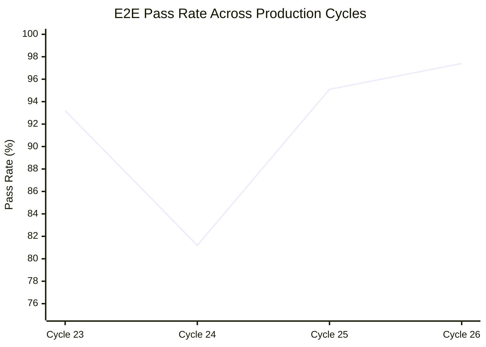
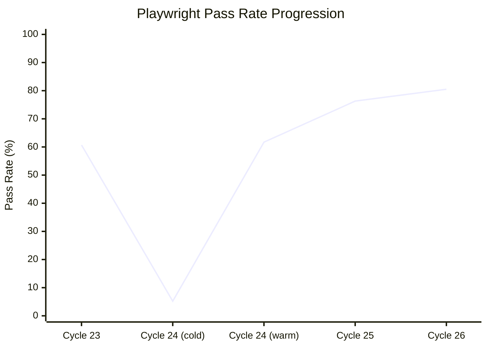
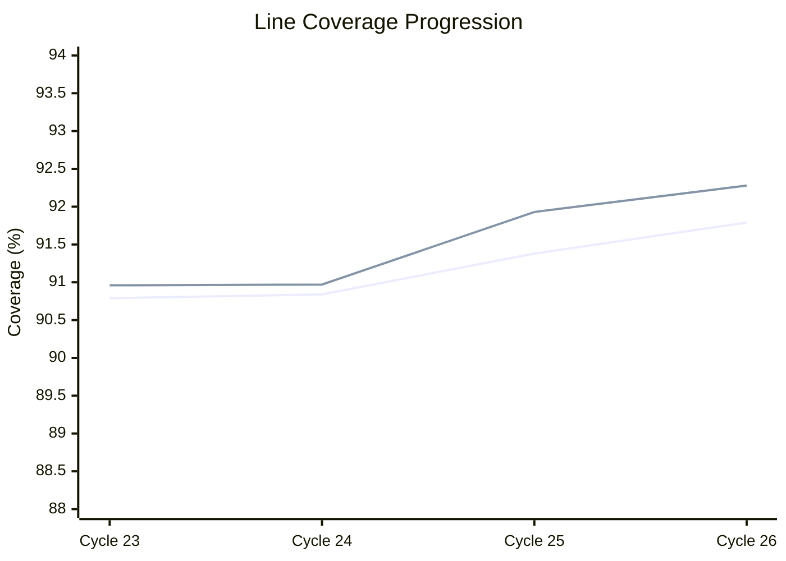

# Production Metrics

How BlockSight's quality metrics improved across 27 production evaluation cycles. Every number was measured on the live production server running real Bitcoin Core data.

---

## The Honest Drop

The most important story in these numbers is what happened in early April 2026.

We ran an honesty sweep across all E2E tests and discovered that **try/catch blocks were silently swallowing real failures**. Tests that should have failed were passing because errors were caught and discarded. We removed every masking try/catch.

The result: E2E dropped from 93.2% to 81.2% overnight. We chose to break our own metrics rather than ship false confidence.

Over the next three cycles, we fixed the real bugs those tests had been hiding. The pass rate climbed back — this time honestly — to 97.4%.

---

## Progression Summary

| Cycle | Date | E2E | Playwright | k6 | Chaos | Soak Error | BE Coverage | FE Coverage |
|-------|------|-----|-----------|-----|-------|-----------|-------------|-------------|
| 23 | Apr 3 | 93.2% | 60.7% | 24/24 | — | 0.00% | 90.79% | 90.96% |
| 24 | Apr 4 | 81.2% | 5.2% | 24/24 | — | 0.40% | 90.84% | 90.97% |
| 25 | Apr 5 | 95.1% | 76.3% | 24/24 | 4/4 | 0.00% | 91.38% | 91.93% |
| **26** | **Apr 6** | **97.4%** | **80.5%** | **24/24** | **10/10** | **0.04%** | **91.79%** | **92.28%** |

---

## E2E Test Pass Rate

**Key events**:
- **Cycle 24 drop (93.2% to 81.2%)**: Intentional. Removed try/catch blocks masking 22 real test failures. We chose honest metrics over good-looking numbers.
- **Cycle 25 recovery (to 95.1%)**: Fixed the 15 real bugs the honesty sweep exposed. ATDD review sessions identified root causes.
- **Cycle 26 peak (97.4%)**: CEO decision implementation + remaining bug fixes. New best ever. 558 of 573 scenarios passing.

---

## Playwright Visual Testing

Playwright visual tests launch a real browser (Chromium) against the live production frontend. The dramatic cycle 24 drop to 5.2% was caused by CDN cold cache — the first page load took too long and screenshots captured loading states instead of rendered content. After the CDN warmed, the same cycle measured 61.7%.

By cycle 26, consistent improvements in loading performance and viewport handling brought Playwright to 80.5%.

---

## k6 Load Testing

**24/24 endpoints passing across 6 consecutive cycles.** k6 smoke tests hit every REST API endpoint and measure response time, status codes, and error rates under load.

| Metric | Value |
|--------|-------|
| Endpoints tested | 24 |
| Consecutive perfect runs | 6 |
| Average response time | < 50ms (cached endpoints) |

---

## Chaos Engineering

Chaos testing deliberately kills infrastructure components and verifies the system recovers gracefully.

| Phase | Scenario | Status |
|-------|----------|--------|
| 1 | Redis connection failure | PASS |
| 2 | PostgreSQL connection failure | PASS |
| 3 | Bitcoin Core RPC failure | PASS |
| 4 | Fulcrum (Electrum) connection failure | PASS |
| 5 | ZMQ publisher failure | PASS |
| 6 | Cascading Redis + PostgreSQL failure | PASS |
| 7 | Full external service outage | PASS |
| 8 | Memory pressure simulation | PASS |
| 9 | Network partition simulation | PASS |
| 10 | Rapid service restart cycle | PASS |

Chaos started at 4 scenarios (cycle 25) and expanded to 10 (cycle 26). All scenarios pass with graceful degradation — circuit breakers trip, the system serves cached data, and recovers automatically when services return.

---

## Soak Testing

Soak tests run the system under sustained load for 60+ minutes and measure stability.

| Cycle | Error Rate | Total Requests | p95 Latency | Notes |
|-------|-----------|---------------|-------------|-------|
| 23 | **0.00%** | 212,496 | 11.35ms | Clean baseline |
| 24 | 0.40% | ~210,000 | 7.24ms | Soak + Playwright ran concurrently (resource contention) |
| 25 | **0.00%** | 212,508 | 10.47ms | Clean after separating workloads |
| 26 | 0.04% | 216,546 | **1.52ms** | 90 congestion endpoint errors (P1, investigation queued) |

The p95 latency improvement from 11.35ms to 1.52ms (7.5x faster) reflects cache warming optimizations and connection pool tuning deployed between cycles 25 and 26.

Earlier staging cycles saw error rates as high as 18.8% — a **470x improvement** to the current 0.04%.

---

## Code Coverage

| Cycle | Backend Lines | Backend Branches | Frontend Lines | Frontend Branches |
|-------|--------------|-----------------|---------------|------------------|
| 23 | 90.79% | — | 90.96% | — |
| 24 | 90.84% | — | 90.97% | — |
| 25 | 91.38% | 82.60% | 91.93% | 83.15% |
| 26 | 91.79% | 82.82% | 92.28% | 83.91% |

Coverage grew steadily while the codebase expanded (from 26,987 to 27,441 tests). Branch coverage — the harder metric — tracks at 82-84%.

---

## Test Count Growth

| Cycle | Test Cases | Test Suites | Delta |
|-------|-----------|-------------|-------|
| 23 | 26,987 | 1,198 | — |
| 24 | 27,012 | 1,198 | +25 |
| 25 | 27,227 | 1,198 | +215 |
| 26 | 27,441 | 1,203 | +214 |

Test count grew by **454 tests** across 4 cycles while maintaining >97% pass rate. New tests were added for CEO-specified behaviors, billing features, and i18n infrastructure.

---

## Production Cycle Grades

| Cycle | Grade | Key Achievement |
|-------|-------|----------------|
| 23 | A- | First soak test at 0.00% error rate |
| 24 | A- | Honest try/catch removal — chose integrity over metrics |
| 25 | A | First chaos engineering run (4/4 pass). Full ATDD review recovery. |
| 26 | A | Best-ever E2E (97.4%). Chaos expanded to 10/10. Coverage sprint. |

---

## What These Numbers Mean

These metrics weren't achieved by writing easy tests or ignoring failures. The project went through a deliberate quality arc:

1. **Build fast** — get features working
2. **Audit honestly** — discover that many tests were trivially passing
3. **Fix systematically** — ATDD reviews, CEO spec alignment, root cause analysis
4. **Prove it in production** — every metric measured on live infrastructure with real Bitcoin data

The honest drop in cycle 24 is the most important data point. Any project can show improving numbers. Fewer choose to expose their own weaknesses and fix them publicly.

---

**See also**: [[Statistics]] | [[Test Strategy]] | [[The Vibe Coding Story]]
