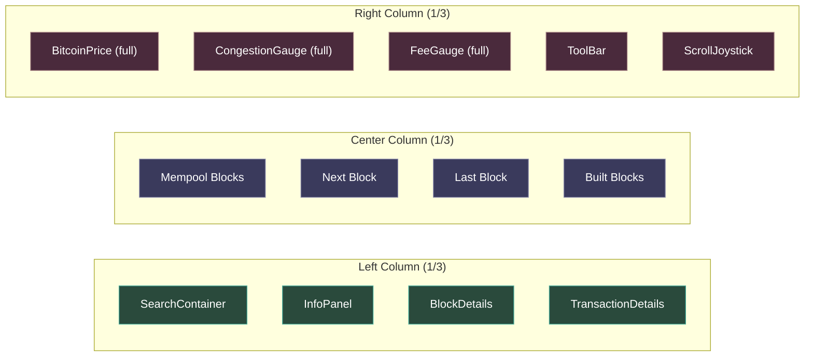
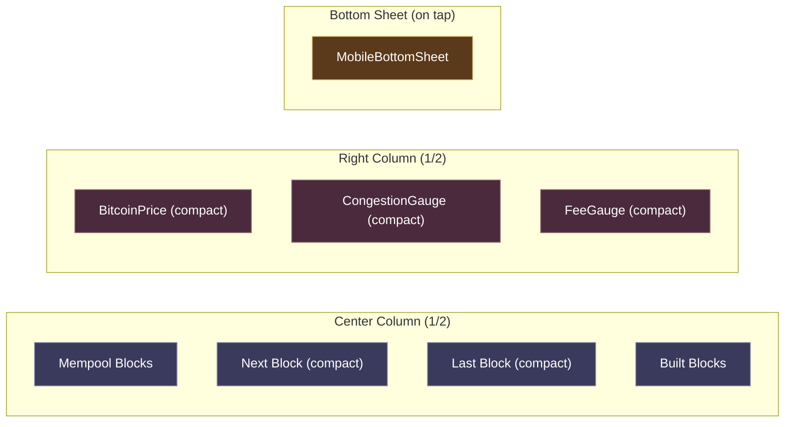
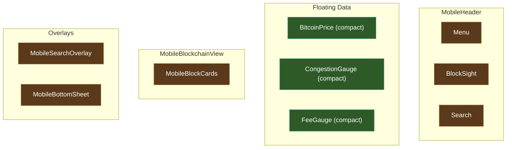

# Responsive Strategy

BlockSight renders on desktop, tablet, and phone through a breakpoint-driven layout system with component variants.

---

## Three Breakpoints

| Breakpoint | Width | Layout | Columns |
|------------|-------|--------|---------|
| Desktop | > 1100px | Triple-column | Left (info panel) + Center (blockchain) + Right (dashboard data) |
| Tablet | 769px - 1100px | Dual-column | Center + Right, info panel overlays |
| Phone | < 769px | Single-column | Dedicated MobileDashboard component |

The `ViewportContext` is the single source of truth for the current viewport category. All layout decisions flow from this context.

---

## The Variant System

Components that need to display differently at smaller sizes use a `variant` prop:

```
variant="full"     -- desktop, all details shown
variant="compact"  -- tablet/mobile, condensed display
```

For example, `BitcoinPrice` in `full` mode shows the secondary fiat currency, 24-hour change with dollar amount and percentage, and ATH glow effect. In `compact` mode, it shows only the price and change percentage.

Components that use variants: `BitcoinPrice`, `FeeGauge`, `CongestionGauge`, `BlockCard`.

---

## MobileDashboard

Below 769px, the desktop layout is completely replaced by `MobileDashboard` — a purpose-built mobile component, not a CSS rearrangement of the desktop layout. This gives phone users:

- Swipeable sections instead of columns
- Touch-optimized controls (44px minimum touch targets)
- Compact block cards designed for small screens
- Bottom sheet for transaction details instead of a side panel
- Mobile-specific search overlay

---

## Layout Architecture

### Desktop (> 1100px)



### Tablet (769px - 1100px)



### Phone (< 769px)



---

## The Tablet Detail Panel Story (CQ-01)

This responsive architecture was validated through real testing. During the ATDD review process (12 sessions reviewing CEO specifications against code), 8 out of 12 sessions revealed that tablet viewport was degraded or broken.

The most significant finding (CQ-01): at tablet width, the left column containing detail panels was hidden, but no alternative existed. Users could search for a block but had no way to view the results.

The fix: extend the `MobileBottomSheet` component (originally phone-only) to also serve tablet. When a user taps a block card at tablet width, a bottom sheet slides up with the full detail panel — the same swipe-to-dismiss pattern used on phone.

This is why testing at all three viewports matters. Desktop worked. Phone worked (MobileDashboard handles it). Tablet had a gap that only manual testing at that exact width revealed.

---

## Responsive Tokens

The design token system includes responsive-aware values:

- `--bp-tablet` (1024px), `--bp-mobile` (768px) -- breakpoint reference tokens
- `responsive-scale.css` -- `clamp()`-based scaling for height-constrained viewports
- All spacing, font sizes, and component dimensions use relative units or CSS clamp functions

---

**See also**: [Desktop Layout](../Architecture/Desktop-Layout) | [Tablet Layout](../Architecture/Tablet-Layout) | [Phone Layout](../Architecture/Phone-Layout)
