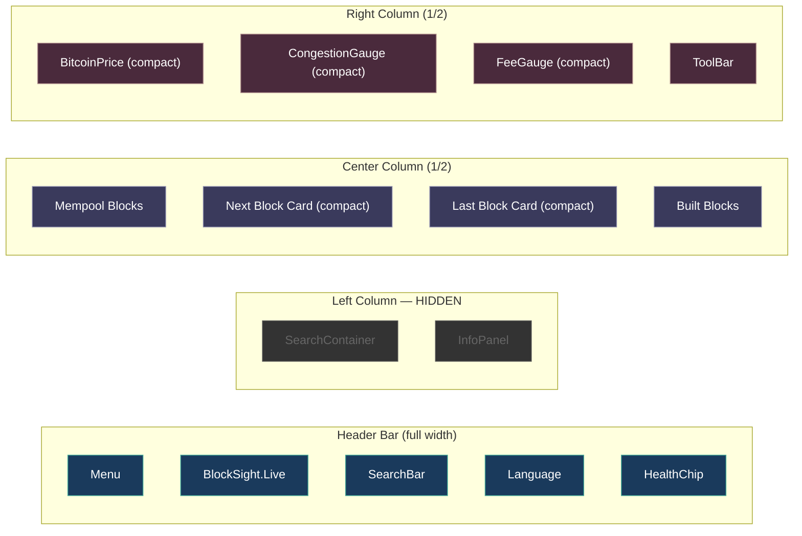

# Tablet Layout

Dual-column responsive layout for screens between 769px and 1100px.

---

## Layout Diagram

---

## Tablet Characteristics

| Property | Value |
|----------|-------|
| Breakpoint | 769px - 1100px |
| Grid | `grid-template-columns: 1fr 1fr` |
| Left Column | Hidden (`showLeftColumn: false`) |
| Widget Variant | `compact` — smaller gauges, reduced text |
| Block Card Variant | `compact` — smaller with essential data only |
| ScrollJoystick | Hidden |
| Header | Same as desktop (may be snug at lower end) |

---

## Key Design Decisions

### Left Column Hidden
At tablet width, the left column (search results + detail panels) is hidden to give the blockchain visualization and gauges enough space. Search and detail viewing use the **MobileBottomSheet** component instead — the same swipe-to-dismiss overlay used on phone, extended to tablet via CEO directive.

### Compact Variants
All three dashboard gauges (BitcoinPrice, CongestionGauge, FeeGauge) switch to `variant='compact'`, which reduces their visual footprint. Block cards also use their compact variant with less metadata displayed.

### What Moves Where

| Desktop Feature | Tablet Behavior |
|----------------|----------------|
| Left column search | Header SearchBar (always visible) |
| InfoPanel details | MobileBottomSheet (tap to open, swipe to dismiss) |
| Full gauge display | Compact gauge variants |
| Full block cards | Compact block cards |
| ScrollJoystick | Hidden (scroll via touch/mouse) |
| ToolBar | Available but narrower |

---

**See also**: [[Desktop Layout]] | [[Phone Layout]] | [[Component Tree]]
