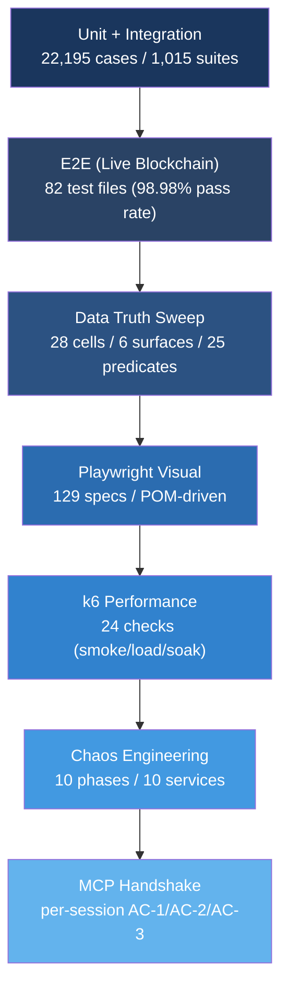

# Test Strategy

BlockSight's testing philosophy: **test on real data, not mocks**. E2E tests run against a live Bitcoin Core node with real blockchain data. When we assert that block 943,000 has the correct miner, we check against the actual Bitcoin network.

**Last refreshed**: 2026-04-20 (DELTA maintenance — verified current against upstream TEST_MAP post D-92 sweep array-iteration extension + D-95 block-added Poisson-rationale. Customer-facing content unchanged; sweep engine internal path syntax and stochastic-outcome semantics are developer-layer details kept in source documentation. Prior same-day refresh added §Invariant-Emission Layer (M-120) + PL-C45 metrics snapshot; 2026-04-19 refresh covered M-97/M-98/M-99/M-103/M-110-A/M-118).

## Latest Production Metrics (PL-C45)

| Metric | Result | Notes |
|--------|--------|-------|
| **E2E** | **98.90%** (631/638) | Live Bitcoin Core + Fulcrum + PostgreSQL. Total adjusted after G_C-77 frontend-retirement track deleted 2 dead suites |
| **Playwright** | **129 specs** across explorer, admin, portal, cross-cutting, capture | POM-driven, chromium-slow + chromium-fast + mobile projects |
| **k6 smoke** | **24/24** | Consecutive cycles with perfect scores |
| **Chaos** | **10/10** | All resilience phases pass (60s chaos run) |
| **Soak** | **0.00% errors, p95 15.05ms** | Best-ever: 15-minute sustained load |
| **Coverage (BE)** | **95.53% lines** | 22 backend domains |
| **Coverage (FE)** | **94.82% lines** | 0.18pp below 95% floor gate |
| **Total tests** | **22,195+** | Unit + integration (1,015+ suites) |

## The Testing Pyramid

## Test Runners

| Runner | Purpose | Scale |
|--------|---------|-------|
| Jest (unit) | Domain logic, transformers, hooks, services | 22,195 cases across 1,015 suites (608 BE + 407 FE) |
| Jest (E2E) | Data accuracy, API contracts, WebSocket events | 82 test files against live infrastructure (98.98% pass) |
| Data Truth Sweep | Value correctness: API data vs Bitcoin Core RPC ground truth | 28 cells, 6 surfaces, 25 predicates, 6 cross-path pairs (M-99) |
| Playwright | Visual regression, responsive layouts, user journeys | 129 spec files across explorer, admin, portal, cross-cutting, capture |
| k6 | Load, soak, and performance baselines | 24 checks (smoke 10s / load 2 min / soak 15 min) |
| Chaos | Infrastructure resilience testing | 10 phases covering Redis, PG, Bitcoin Core, Fulcrum, ZMQ, DNS, WS |
| MCP smoke | MCP server session-lifecycle regression | AC-1 (header mint) / AC-2 (SID1≠SID2) / AC-3 (7-tool list) assertions |

## Why Real Data, Not Mocks

Mock-based testing hides real bugs. We learned this when mocked tests passed but production showed wrong fee estimates because the transformer silently dropped a field.

- **Data accuracy tests** compare API responses against Bitcoin Core RPC directly
- **Fee estimation** is validated against real mempool state
- **Congestion scores** run through the CEO's algorithm with live network data
- **Block enrichment** verifies miner labels, transaction counts, and fee totals against the chain
- **Data Truth Sweep** exercises every external field (REST + WebSocket + frontend) against its Bitcoin Core source of truth with unit-safety invariants (sat/vB vs satoshis), cross-path consistency, and field-level assertions

The E2E suite connects to the actual Bitcoin node, queries the real mempool, and verifies against the live Electrum server. No test doubles. No fixtures. Real blockchain data.

## Coverage by Domain

Coverage is measured per-domain, not in aggregate:

| Domain Category | Backend Lines | Frontend Lines |
|-----------------|---------------|----------------|
| Core business (billing, subscription, auth) | 90%+ | N/A |
| Blockchain (bitcoin-core, electrum, explorer) | 90%+ | 90%+ |
| Data processing (transformers, projections) | 92%+ | 92%+ |
| Platform (webhook, fx, usage) | 88%+ | N/A |

Aggregate line coverage is 95.53% BE / 94.43% FE (PL-C43, all-time highs). Coverage deltas are gated cycle-over-cycle: regressions >0.5pp lines or >1.0pp functions fail the cycle. An absolute floor gate (95% target) also fires if aggregate drops below target regardless of delta.

## Chaos Testing: 10 Phases

Production resilience testing that intentionally breaks infrastructure:

| Phase | Service | Disruption | What We Verify |
|-------|---------|-----------|----------------|
| 1 | Redis | Service stopped 30s | Cache circuit breaker activates, services degrade |
| 2 | PostgreSQL | Service stopped 30s | Database circuit breaker, read fallbacks |
| 3 | Bitcoin Core RPC | Port blocked 30s | Blockchain data serves from cache |
| 4 | Fulcrum | Port blocked 30s | Address lookups degrade, search still works |
| 5 | ZMQ publisher | Ports blocked 30s | Block notifications stop, polling fallback |
| 6 | Kraken WebSocket | Outbound blocked | Price feed loss, cached prices served |
| 7 | REST APIs | Endpoints blocked | CoinGecko/CoinCap circuit breakers fire |
| 8 | Multi-service | Redis + BTC Core simultaneously | Cascade degradation, no crashes |
| 9 | WebSocket surge | 100 simultaneous connections | Memory stable, connections managed |
| 10 | DNS failure | UDP+TCP 53 blocked | External API isolation verified |

Each phase: disrupt for 30s, verify graceful degradation (no crashes), restore, verify full recovery.

## k6 Performance Profiles

| Profile | VUs | Duration | Latest Result |
|---------|-----|----------|---------------|
| Smoke | 1 | 10s | 24/24 checks, p95 < 50ms |
| Load | 50 | 2 min | 0.00% error rate |
| Soak | 10 | 15 min | 0.00% errors, p95 14.75ms |

The smoke test has held 24/24 for 14+ consecutive production cycles.

## Playwright Visual Testing

129 spec files across three Playwright projects (chromium-slow for `.slow.spec.ts`, chromium-fast for the bulk of assertions, mobile for touch layouts). POM-driven: Page Object Model classes encapsulate locators so specs assert on behavior, not CSS selectors.

- **Explorer**: dashboard widgets, block history, search, address/transaction details, mobile layout, animation FSM, deep-linking, calculator, legal pages
- **Portal**: auth flow, subscription funnel, API keys, billing, webhooks, usage, onboarding
- **Admin**: CEO/CTO/CRM dashboards, payments, feature flags, TZUR customer view
- **Cross-cutting**: RTL (Hebrew/Arabic/Persian/Urdu), i18n, WebSocket events, toasts, viewport bugs, error states, deep-linking, accessibility
- **Visual**: pixel-level regression baselines (Nastaliq font rendering, chart rendering)
- **Capture**: cycle-tagged baseline screenshots across 4 viewports × 11 states

Screenshots are captured per production cycle using pixelmatch for visual regression detection against the previous cycle's baseline.

## Zod Runtime Validation

TypeScript types disappear at runtime. Backend sends `{error: {code, message}}` but the frontend type says `error: string` — React renders `[object Object]` and crashes. Zod schemas catch this at the API boundary, before React ever sees it.

- **79 safeParse calls** across 4 bridges (portal, CEO, CTO, CRM)
- **47 schema files** in the shared schemas package across 11 categories (envelopes, portal REST, admin REST, blockchain REST, Express REST, Hono REST, data REST, shared, WebSocket, utils, barrel exports)
- **42 WebSocket event schemas** for real-time data validation
- **Fail-open design**: invalid data logs a warning but never throws — the app stays up

## MCP Handshake Testing (M-118)

The MCP server exposes 7 read-only tools for AI integrations (ChatGPT, Claude Custom Connectors). Session-lifecycle regression is exercised every production cycle:

- **AC-1**: `POST /mcp initialize` returns HTTP 200 with a fresh `Mcp-Session-Id` header (case-insensitive)
- **AC-2**: A second `initialize` (no header) returns a DIFFERENT session id — singleton transport regression guard
- **AC-3**: `POST /mcp tools/list` echoing `Mcp-Session-Id` returns exactly 7 tools with verbatim names

Per-session transport architecture replaced a singleton pre-M-118 — every subsequent initialize used to fail with `-32600 Invalid Request` because the SDK set `_initialized=true` on the shared transport. The smoke phase catches this class at the runbook level so a regression never reaches production.

## Auth Attestation Testing (M-110-A)

Per-device JWT authentication uses Apple App Attest and EdDSA (Ed25519) signatures. Test coverage across 4 gates:

- **Unit**: `JwtSigner` + `JwtVerifier` + `ChallengeStore` + `AttestService` (fail-fast on malformed PEM at startup, challenge race-consumed returns 409, device revocation returns 401)
- **Integration**: 30-second live-revocation SLA proof using `jest.useFakeTimers()` on the Redis pub/sub subscriber
- **E2E**: `/v1/auth/challenge` → attest → Bearer JWT happy path + revoked-device rejection
- **WebSocket**: upgrade handler dual-mode auth (JWT path + legacy `bs_live_` path), close codes 4009/4010 for revocation/attestation rejection

## Invariant-Emission Layer (M-120 Proactive Quality Track)

The M-120 proactive-quality track added a runtime layer to the data-truth test pyramid: every external data-truth contract that can drift in production is now instrumented with a runtime counter that increments on violation and pages the operator within 5 minutes via Grafana.

**Source of truth**: a catalog file lists every invariant with canonical-sample / example-violation / emission-site. Nine invariants are wired as of the 2026-04-20 snapshot across seven pipelines (auth / mcp / ws / fees / tx-explorer / block-metadata / price).

**Runtime counter**: a single shared Prometheus counter named `blocksight_invariant_violations_total` with labels `{pipeline, check}`. One counter, many contracts — the label pair identifies the specific invariant.

**Critical alert**: `InvariantViolationDetected` — fires on any increase over a 5-minute window, severity critical, pages the operator. Source-side unit tests prove the code CAN emit the signal; the wired counter proves the signal ARRIVES under production load.

**Test pyramid integration**: this is the fourth DATA TRUTH RULE check (joining unit safety, cross-field assertions, cross-path consistency). BETA harness audits grade the Runtime Signal Under Production Load pillar on invariant-emission evidence: A-grade requires cited emission site + Grafana alert cross-ref + ALPHA phase-probe presence; F-automatic if a component has a catalog invariant with zero runtime emission sites (the pre-M-120 ghost-completion class).

**Companion harness additions (M-120 siblings)**:

- **REST contract snapshot tests** — six customer-facing external REST endpoints lock Zod schemas with unit annotations (sat/vB vs satoshis) + byte-frozen canonical samples. Contract drift fails at CI in ~30 minutes, not at an ALPHA cycle 2-4 days later.
- **5-probe alpha canary** — the phase-8c historic-tx canary extended to 5 probes with bitwise exit-code isolation (genesis-404 / MCP-init dual-SID / WS-revoke 30s-SLA passive observation / confirmed-tx blockHeight / miner-label cardinality) under a 60-second budget. Each probe has an independent failure mode classification for single-lookup triage.
- **Runbook-reference verifier** — a commit-time gate that greps every `phase-*.sh` script for ghost paths / wrong-project references / dead environment exports. Closes a recurring 10-incident-in-10-days drift class at the authoring surface.

## Historical Progression

| Cycle | E2E | k6 | Chaos | Coverage |
|-------|-----|-----|-------|----------|
| PL-C30 | 98.1% | 24/24 | 10/10 | BE 92.5% / FE 93.5% |
| PL-C37 | 96.6% | 24/24 | 10/10 | BE 94.87% / FE 94.12% |
| PL-C38 | 97.0% | 24/24 | 10/10 | BE 95.18% / FE 94.12% (BE crossed 95%) |
| PL-C41 | 98.7% | 24/24 | 10/10 | BE 95.4% / FE 94.28% |
| PL-C42 | **98.98%** (699/706) | 24/24 | 10/10 | BE 95.53% / FE 94.43% (all-time high) |
| PL-C43 | 98.86% | 24/24 | 10/10 | BE 95.53% / FE 94.43% (holding) |
| PL-C44 | 98.72% (697/706) | 24/24 | 10/10 | BE 95.30% / FE 94.83% (FE ATH +0.40pp) |
| PL-C45 | 98.90% (631/638) | 24/24 | 10/10 | BE 95.53% / FE 94.82% |

Key milestones: try/catch removal exposed 22 hidden failures (PL-C24). Chaos expanded 4→10 phases. Zod runtime validation added (PL-C29). Coverage sprint +1,280 tests (PL-C30). E2E harness rebuilt as 7-layer module system (M-97). Playwright rebuilt POM-first with 129 spec coverage (M-98). Data Truth Sweep engine added with 25 predicates across 6 surfaces (M-99). External API + MCP server added with 55 new tests (M-103). BE line coverage hit 95% at PL-C38, held through PL-C45. Per-session MCP transport (M-118) closed the singleton-initialize regression class. Per-device JWT + 30s live revocation (M-110-A + M-110-A-WS-EXT) closed the auth-attribution bug class. M-120 added the runtime-invariant emission layer closing the ghost-completion class (2026-04-20).
