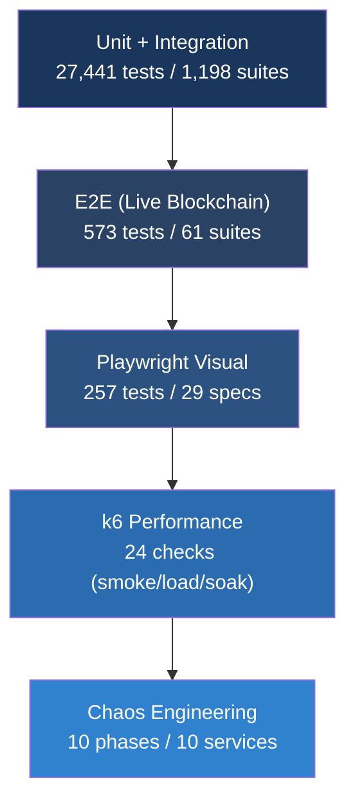

# Test Strategy

BlockSight's testing philosophy: **test on real data, not mocks**. E2E tests run against a live Bitcoin Core node with real blockchain data. When we assert that block 943,000 has the correct miner, we check against the actual Bitcoin network.

## Production Metrics (PL-C26)

| Metric | Result | Notes |
|--------|--------|-------|
| **E2E** | **97.4%** (558/573) | Live Bitcoin Core + Fulcrum + PostgreSQL |
| **Playwright** | **80.5%** (207/257) | 3 viewports, 29 specs |
| **k6 smoke** | **24/24** | 6th consecutive perfect score |
| **Chaos** | **10/10** | First full-mode all-phases pass |
| **Soak** | **0.04%** errors, p95 1.52ms | 60-minute sustained load |
| **Coverage (BE)** | **91.79%** lines | 22 backend domains |
| **Coverage (FE)** | **92.28%** lines | 5 frontend domains |
| **Total tests** | **27,441** | Across 1,198 suites |

## The Testing Pyramid

## Test Runners

| Runner | Purpose | Scale |
|--------|---------|-------|
| Jest (unit) | Domain logic, transformers, hooks, services | 27,441 cases across 1,198 suites |
| Jest (E2E) | Data accuracy, API contracts, WebSocket events | 573 tests against live infrastructure |
| Playwright | Visual regression, responsive layouts, user journeys | 257 tests across 29 specs |
| k6 | Load, soak, and performance baselines | 24 checks (smoke/load/soak profiles) |
| Chaos | Infrastructure resilience testing | 10 phases covering all dependencies |

## Why Real Data, Not Mocks

Mock-based testing hides real bugs. We learned this when mocked tests passed but production showed wrong fee estimates because the transformer silently dropped a field.

- **Data accuracy tests** compare API responses against Bitcoin Core RPC directly
- **Fee estimation** is validated against real mempool state
- **Congestion scores** run through the CEO's algorithm with live network data
- **Block enrichment** verifies miner labels, transaction counts, and fee totals against the chain

The E2E suite connects to the actual Bitcoin node, queries the real mempool, and verifies against the live Electrum server. No test doubles. No fixtures. Real blockchain data.

## Coverage by Domain

Coverage is measured per-domain, not in aggregate:

| Domain Category | Backend Lines | Frontend Lines |
|-----------------|---------------|----------------|
| Core business (billing, subscription, auth) | 90%+ | N/A |
| Blockchain (bitcoin-core, electrum, explorer) | 90%+ | 90%+ |
| Data processing (transformers, projections) | 92%+ | 92%+ |
| Platform (webhook, fx, usage) | 88%+ | N/A |

Branch coverage (~82-84%) is the active gap being closed.

## Chaos Testing: 10 Phases

Production resilience testing that intentionally breaks infrastructure:

| Phase | Service | Disruption | What We Verify |
|-------|---------|-----------|----------------|
| 1 | Redis | Service stopped 30s | Cache circuit breaker activates, services degrade |
| 2 | PostgreSQL | Service stopped 30s | Database circuit breaker, read fallbacks |
| 3 | Bitcoin Core RPC | Port blocked 30s | Blockchain data serves from cache |
| 4 | Fulcrum | Port blocked 30s | Address lookups degrade, search still works |
| 5 | ZMQ publisher | Ports blocked 30s | Block notifications stop, polling fallback |
| 6 | Kraken WebSocket | Outbound blocked | Price feed loss, cached prices served |
| 7 | REST APIs | Endpoints blocked | CoinGecko/CoinCap circuit breakers fire |
| 8 | Multi-service | Redis + BTC Core simultaneously | Cascade degradation, no crashes |
| 9 | WebSocket surge | 100 simultaneous connections | Memory stable, connections managed |
| 10 | DNS failure | UDP+TCP 53 blocked | External API isolation verified |

Each phase: disrupt for 30s, verify graceful degradation (no crashes), restore, verify full recovery.

## k6 Performance Profiles

| Profile | VUs | Duration | Latest Result |
|---------|-----|----------|---------------|
| Smoke | 1 | 10s | 24/24 checks, p95 < 50ms |
| Load | 50 | 2 min | 0.00% error rate |
| Soak | 10 | 60 min | 0.04% errors, p95 1.52ms |

The smoke test has achieved 24/24 for 6 consecutive production cycles.

## Playwright Visual Testing

29 specs covering the full user experience across 3 viewports:

- **Explorer**: dashboard widgets, block history, search, address/transaction details
- **Responsive**: layout verification at desktop (1440px), tablet (900px), phone (375px)
- **Portal**: customer journey (register, dashboard, API keys, billing, settings)
- **Admin**: CEO dashboard, CTO dashboard
- **Cross-cutting**: RTL (Hebrew/Arabic), deep linking, error states, toolbar, calculator

Screenshots are captured at 3 viewports and compared daily using pixelmatch for visual regression detection.

## Historical Progression

| Cycle | E2E | k6 | Chaos | Coverage |
|-------|-----|-----|-------|----------|
| PL-C24 | 81.2% | 24/24 | 4/4 | BE 90.8% / FE 91.0% |
| PL-C25 | 95.1% | 24/24 | 4/4 | BE 91.4% / FE 91.9% |
| PL-C26 | **97.4%** | **24/24** | **10/10** | **BE 91.8% / FE 92.3%** |

Key improvements: try/catch removal exposed 22 hidden failures in PL-C24. Chaos expanded from 4 to 10 phases. Coverage sprint added 214 tests.
