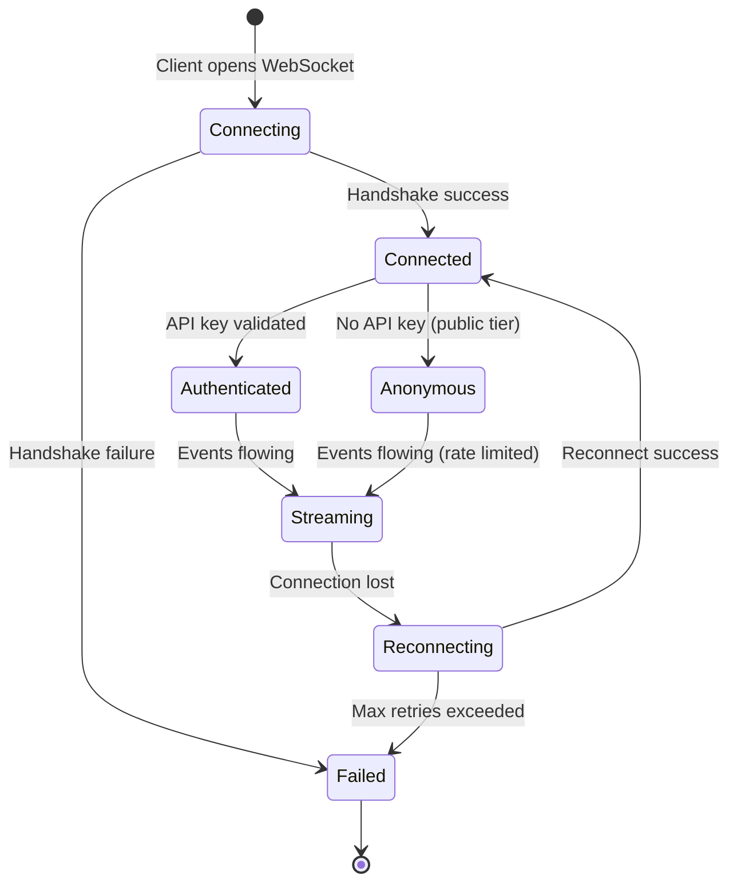
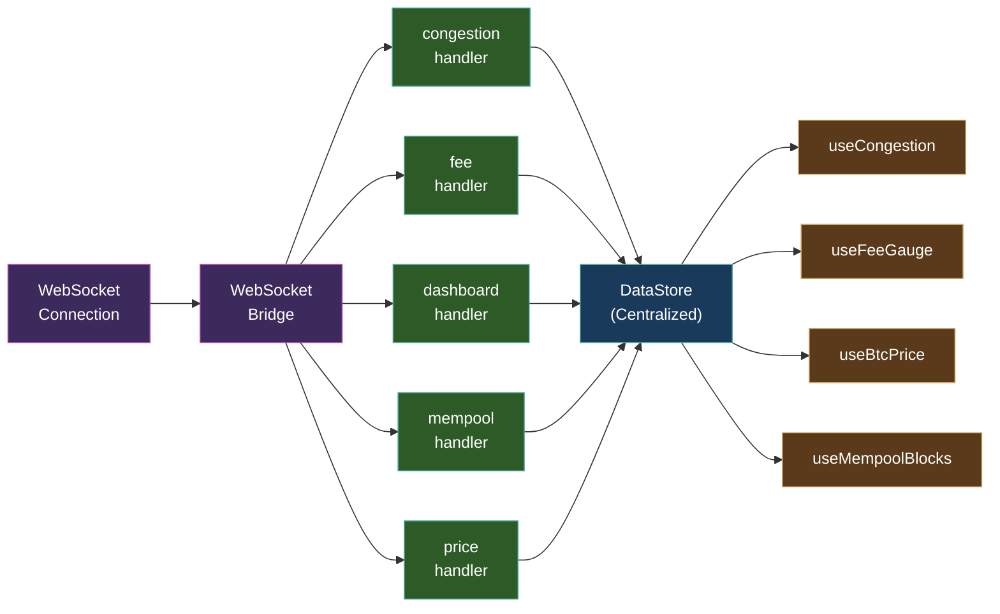

# WebSocket Architecture

BlockSight's real-time event system delivers live Bitcoin data to every connected browser. The system handles 38 event types with tier-based authentication, rate limiting, backpressure management, and deduplication.

---

## High-Level Flow

```
User Browser    Frontend App    WebSocket Hub    Backend Services    Bitcoin Core
     |               |               |               |               |
     |  Connect      |               |               |               |
     |-------------->|               |               |               |
     |               |  WS Connect   |               |               |
     |               |-------------->|               |               |
     |               |               |  Poll Data    |               |
     |               |               |-------------->|               |
     |               |               |               |  RPC Call     |
     |               |               |               |-------------->|
     |               |               |               |  Response     |
     |               |               |               |<--------------|
     |               |               |  Cache Data   |               |
     |               |               |<--------------|               |
     |               |  WS Event     |               |               |
     |               |<--------------|               |               |
     |  UI Update    |               |               |               |
     |<--------------|               |               |               |
```

**Timing**: 1-2s data freshness. Sub-millisecond cache access. Immediate UI updates.

---

## Event System

### Event Types

BlockSight broadcasts **38 typed WebSocket events** organized into two tiers:

| Tier | Trigger | Events |
|------|---------|--------|
| **PUSH** | Immediate (ZMQ or event-driven) | `new_block`, `mempool_blocks`, `price_update` |
| **SCHEDULED** | Interval-based polling | `dashboard.update` (5s), `congestion_update` (30s), `fee_update` (30s), `blocks_history` |

### Key Events

| Event | Description | Frequency |
|-------|-------------|-----------|
| `dashboard.update` | BTC price, blockchain summary, derived fee rates | Every 5s |
| `congestion_update` | Network congestion gauge data (5-component score) | Every 30s + on new block |
| `fee_update` | Fee estimation for next block and 6-hour target | Every 30s + on new block |
| `mempool_blocks` | Projected mempool block composition | Event-driven (mempool changes) |
| `new_block` | Notification of newly mined block | Immediate via ZMQ |
| `blocks_history` | Recent confirmed blocks with enrichment data | On new/enriched block |
| `price_update` | External price feed data | Every 2s |

---

## Connection Lifecycle



### Authentication
- **Anonymous**: No API key required. Public dashboard data at base rate limits.
- **Authenticated**: Pass `?api_key=` on connection URL. Key validated against API Key Service. Tier metadata stored for rate limit enforcement.
- **Invalid key**: `auth_error` event sent, connection closed with code 4002.

---

## Backpressure Management

The WebSocket hub implements a **3-strike backpressure** system to prevent slow clients from degrading the system:

1. **Strike 1**: Client's message buffer exceeds threshold. Warning logged.
2. **Strike 2**: Buffer still full on next broadcast. Events start being dropped for this client.
3. **Strike 3**: Client consistently cannot keep up. Connection closed gracefully.

This ensures that one slow client (e.g., on a poor mobile connection) cannot block broadcasting to all other clients.

---

## Deduplication

The system achieves a **96.8% bandwidth reduction** through delta compression and deduplication:

- **Dashboard updates**: Only changed fields are broadcast. If the BTC price hasn't changed since the last update, it's not re-sent.
- **Block history**: Enrichment events only include the newly enriched blocks, not the entire history.
- **Mempool blocks**: Incremental projection detects deltas between polls and only broadcasts changes.

---

## Rate Limiting

Rate limits are enforced per connection based on the customer's subscription tier:

| Tier | Events/second | Concurrent connections |
|------|--------------|----------------------|
| Anonymous (public) | Base rate | 1 |
| Basic | Higher rate | Tier-specific |
| Advanced | Higher rate | Tier-specific |
| Premium Plus | Highest rate | Tier-specific |

Rate limits are set dynamically via `RateLimiter.setClientLimit()` after authentication.

---

## Reconnection Flow

```
Frontend App    WebSocket Hook    WebSocket Hub    Backend
     |               |               |               |
     |               |  Connection   |               |
     |               |  Lost         |               |
     |               |<--------------|               |
     |               |  Reconnect    |               |
     |               |  (exp backoff)|               |
     |               |-------------->|               |
     |               |               |  Auth Check   |
     |               |               |-------------->|
     |               |               |  Auth OK      |
     |               |               |<--------------|
     |               |  Connected    |               |
     |               |<--------------|               |
     |               |  Resume       |               |
     |               |  Data Stream  |               |
     |               |<--------------|               |
     |  UI Update    |               |               |
     |<--------------|               |               |
```

The frontend WebSocket hook handles reconnection automatically with exponential backoff. Connection health is displayed via the HealthChip in the header (green = connected, yellow = reconnecting, red = disconnected).

---

## Frontend Consumption

Events arrive at the frontend via a WebSocket bridge with typed handlers:



Each handler writes to a specific path in the centralized DataStore. React hooks read from these paths, triggering component re-renders only when their specific data changes.

---

## Performance Characteristics

| Metric | Value |
|--------|-------|
| Event types | 38 |
| Data freshness | 1-2 seconds |
| Bandwidth reduction | 96.8% (via deduplication) |
| Reconnection | Automatic with exponential backoff |
| Health monitoring | HealthChip displays connection state |

---

**See also**: [[Data Flow]] | [[Cache Architecture]] | [[Component Bible]]
